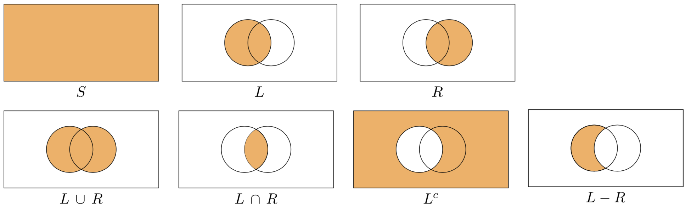

# Insiemi {#sec-apx-sets}

Un insieme (o collezione, classe, gruppo, ...) è stato definito da Georg Cantor nel modo seguente: 

> un insieme è una collezione di oggetti, determinati e distinti, della nostra percezione o del nostro pensiero, concepiti come un tutto unico; tali oggetti si dicono elementi dell'insieme.

Mentre non è rilevante la natura degli oggetti che costituiscono l'insieme, ciò che importa è distinguere se un dato oggetto appartenga o meno ad un insieme. Deve essere vera una delle due possibilità: il dato oggetto è un elemento dell'insieme considerato oppure non è elemento dell'insieme considerato. Due insiemi $A$ e $B$ si dicono uguali se sono formati dagli stessi elementi, anche se disposti in ordine diverso: $A=B$. Due insiemi $A$ e $B$ si dicono diversi se non contengono gli stessi elementi: $A \neq B$. Ad esempio, i seguenti insiemi sono uguali:

$$
\{1, 2, 3\} = \{3, 1, 2\} = \{1, 3, 2\}= \{1, 1, 1, 2, 3, 3, 3\}.
$$

Gli insiemi sono denotati da una lettera maiuscola, mentre le lettere minuscole, di solito, designano gli elementi di un insieme. Per esempio, un generico insieme $A$ si indica con

$$
A = \{a_1, a_2, \dots, a_n\}, \quad \text{con } n > 0.
$$

La scrittura $a \in A$ dice che $a$ è un elemento di $A$. Per dire che $b$ non è un elemento di $A$ si scrive $b \notin A.$

Per quegli insiemi i cui elementi soddisfano una certa proprietà che li caratterizza, tale proprietà può essere usata per descrivere più sinteticamente l'insieme:

$$
A = \{x ~\vert~ \text{proprietà posseduta da } x\},
$$

che si legge come "$A$ è l'insieme degli elementi $x$ per cui è vera la proprietà indicata." Per esempio, per indicare l'insieme $A$ delle coppie di numeri reali $(x,y)$ che appartengono alla parabola $y = x^2 + 1$ si può scrivere:

$$
A = \{(x,y) ~\vert~ y = x^2 + 1\}.
$$

Dati due insiemi $A$ e $B$, diremo che $A$ è un *sottoinsieme* di $B$ se e solo se tutti gli elementi di $A$ sono anche elementi di $B$:

$$
A \subseteq B \iff (\forall x \in A \Rightarrow x \in B).
$$

Se esiste almeno un elemento di $B$ che non appartiene ad $A$ allora diremo che $A$ è un *sottoinsieme proprio* di $B$:

$$
A \subset B \iff (A \subseteq B, \exists~ x \in B ~\vert~ x \notin A).
$$

Un altro insieme, detto *insieme delle parti*, o insieme potenza, che si associa all'insieme $A$ è l'insieme di tutti i sottoinsiemi di $A$, inclusi l'insieme vuoto e $A$ stesso. Per esempio, per l'insieme $A = \{a, b, c\}$, l'insieme delle parti è:

$$
\mathcal{P}(A) = \{
\emptyset, \{a\}, \{b\}, \{c\},
 \{a, b\}, \{a, c\}, \{c, b\},
 \{a, b, c\}
\}.
$$

## Diagrammi di Eulero-Venn

I diagrammi di Venn sono uno strumento grafico molto utile per rappresentare gli insiemi e per verificare le proprietà delle operazioni tra di essi. Questi diagrammi prendono il nome dal matematico inglese del 19° secolo John Venn, anche se rappresentazioni simili erano già state utilizzate in precedenza da Leibniz e Eulero.

I diagrammi di Venn rappresentano gli insiemi come regioni del piano delimitate da una curva chiusa. Nel caso di insiemi finiti, è possibile evidenziare alcuni elementi di un insieme tramite punti, e in alcuni casi possono essere evidenziati tutti gli elementi degli insiemi considerati.

In sostanza, questi diagrammi sono un modo visuale per rappresentare le proprietà degli insiemi e delle operazioni tra di essi. Sono uno strumento molto utile per visualizzare la relazione tra gli insiemi e per capire meglio come si combinano gli elementi all'interno di essi.

## Operazioni tra insiemi

Si definisce *intersezione* di $A$ e $B$ l'insieme $A \cap B$ di tutti gli elementi $x$ che appartengono ad $A$ e contemporaneamente a $B$:

$$
A \cap B = \{x ~\vert~ x \in A \land x \in B\}.
$$

Si definisce *unione* di $A$ e $B$ l'insieme $A \cup B$ di tutti gli elementi $x$ che appartengono ad $A$ o a $B$, cioè

$$
A \cup B = \{x ~\vert~ x \in A \lor x \in B\}.
$$

*Differenza*. Si indica con $A \setminus B$ l'insieme degli elementi di $A$ che non appartengono a $B$:

$$
A \setminus B = \{x ~\vert~ x \in A \land x \notin B\}.
$$

*Insieme complementare*. Nel caso che sia $B \subseteq A$, l'insieme differenza $A \setminus B$ è detto insieme complementare di $B$ in $A$ e si indica con $B^C$.

Dato un insieme $S$, una *partizione* di $S$ è una collezione di sottoinsiemi di $S$, $S_1, \dots, S_k$, tali che

$$
S = S_1 \cup S_2 \cup \dots S_k
$$

e

$$
S_i \cap S_j = \emptyset, \quad \text{con } i \neq j.
$$

La relazione tra unione, intersezione e insieme complementare è data dalle leggi di DeMorgan:

$$
(A \cup B)^c = A^c \cap B^c,
$$ 

$$
(A \cap B)^c = A^c \cup B^c.
$$

In tutte le seguenti figure, $S$ è la regione delimitata dal rettangolo, $L$ è la regione all'interno del cerchio di sinistra e $R$ è la regione all'interno del cerchio di destra. La regione evidenziata mostra l'insieme indicato sotto ciascuna figura.



I diagrammi di Eulero-Venn che illustrano le leggi di DeMorgan sono forniti nella figura seguente.


## Implementazione in R

Vediamo ora come implementare in R i concetti fondamentali della teoria degli insiemi. Gli esempi sono volutamente concisi per servire come riferimento rapido.

### Appartenenza e relazioni base

```{r}
# Definire insiemi
my_set <- c(1, 3, 5)
Super <- c(2, 4, 6, 8)
Sub <- c(4, 6)

# Verificare appartenenza
1 %in% my_set        # TRUE
2 %in% my_set        # FALSE

# Verificare se Sub è sottoinsieme di Super
all(Sub %in% Super)  # TRUE
```

### Operazioni tra insiemi

```{r}
S1 <- c(1, 2, 3, 4, 5)
S2 <- c(4, 5, 6, 7, 8)

# Intersezione
intersect(S1, S2)           # {4, 5}

# Unione
union(S1, S2)               # {1, 2, 3, 4, 5, 6, 7, 8}

# Differenza
setdiff(S1, S2)             # {1, 2, 3}
setdiff(S2, S1)             # {6, 7, 8}

# Complementare (rispetto a un universo)
universo <- 1:10
S <- c(2, 4, 6, 8, 10)
setdiff(universo, S)        # {1, 3, 5, 7, 9}
```

## Coppie ordinate e prodotto cartesiano

Una coppia ordinata $(x,y)$ è l'insieme i cui elementi sono $x \in A$ e $y \in B$ e nella quale $x$ è la prima componente (o prima coordinata) e $y$ la seconda. L'insieme di tutte le coppie ordinate costruite a partire dagli insiemi $A$ e $B$ viene detto **prodotto cartesiano**:

$$
A \times B = \{(x, y) ~\vert~ x \in A \land y \in B\}.
$$

Ad esempio, sia $A = \{1, 2, 3\}$ e $B = \{a, b\}$. Allora,

$$
\{1, 2\} \times \{a, b, c\} = \{(1, a), (1, b), (1, c), (2, a), (2, b), (2, c)\}.
$$

Più in generale, un prodotto cartesiano di $n$ insiemi può essere rappresentato da un array di $n$ dimensioni, dove ogni elemento è una ennupla o tupla ordinata (ovvero, una collezione o un elenco ordinato di $n$ oggetti). Una n-pla ordinata si distingue da un insieme di $n$ elementi in quanto fra gli elementi di un insieme non è dato alcun ordine. Inoltre gli elementi di una ennupla possono anche essere ripetuti. Essendo la n-pla un elenco ordinato, in generale di ogni suo elemento è possibile dire se sia il primo, il secondo, il terzo, eccetera, fino all'n-esimo. Il prodotto cartesiano prende il nome da René Descartes la cui formulazione della geometria analitica ha dato origine al concetto.

```{r}
A <- c("a", "b", "c")
S <- 1:3

# Prodotto cartesiano
cartesian_product <- expand.grid(A, S)
print(cartesian_product)

# Cardinalità del prodotto
nrow(cartesian_product)  # 9 = 3 × 3
```

Si definisce *cardinalità* (o potenza) di un insieme finito il numero degli elementi dell'insieme. Viene indicata con $\vert A\vert, \#(A)$ o $\text{c}(A)$.

**Esempio: potenza del prodotto cartesiano**

```{r}
A <- c("Head", "Tail")

# A²: prodotto cartesiano di A con se stesso
p2 <- expand.grid(A, A)
nrow(p2)  # 4 = 2²

# A³
p3 <- expand.grid(A, A, A)
nrow(p3)  # 8 = 2³
```

::: {.callout-note}
## Collegamento al calcolo delle probabilità
Gli insiemi e il loro prodotto cartesiano sono fondamentali per definire lo spazio campionario negli esperimenti casuali. Ad esempio, il lancio di due monete ha spazio campionario $\Omega = \{\text{Testa}, \text{Croce}\} \times \{\text{Testa}, \text{Croce}\}$, con cardinalità $|\Omega| = 4$.
:::
