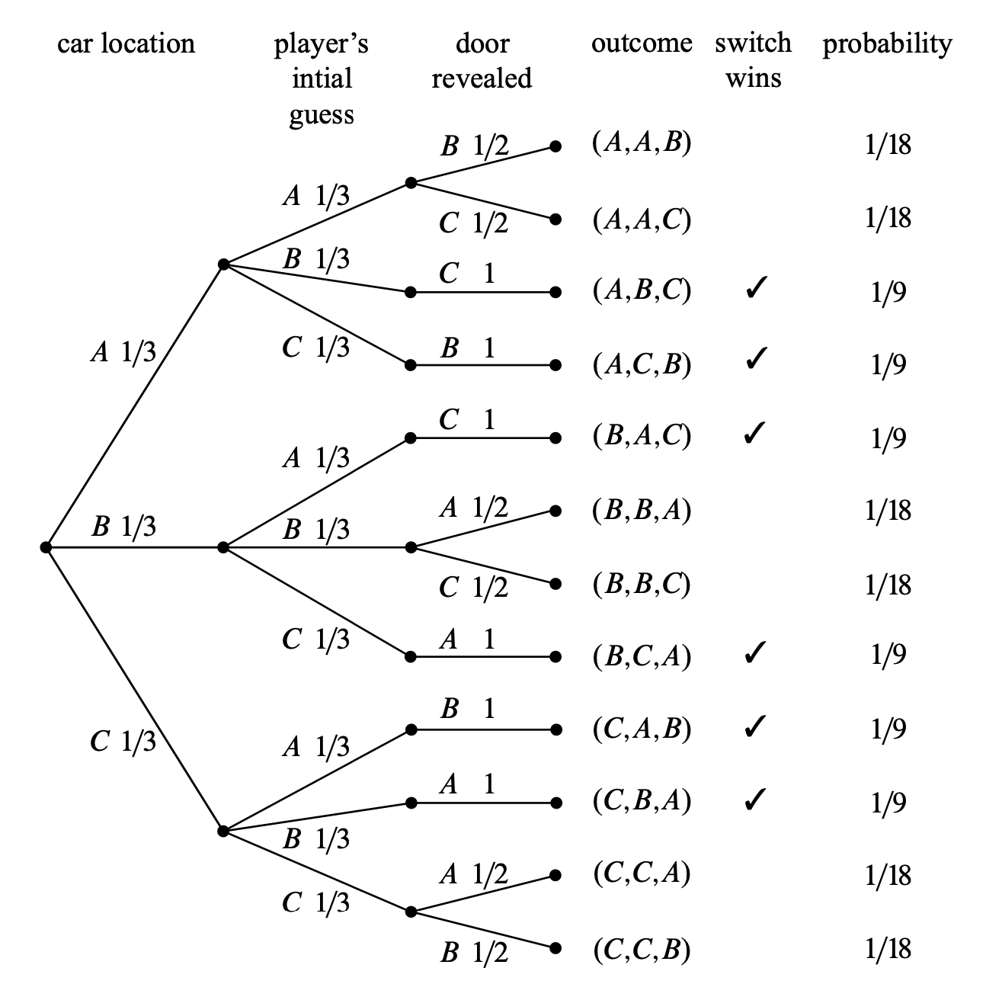

# Probabilità condizionata {#sec-prob-conditional-prob}

::: {.epigraph}
> “Probability is always conditional.”
>
> -- **Dennis V. Lindley**, *The Philosophy of Statistics* (2000). 
:::


## Introduzione {.unnumbered .unlisted}

La probabilità condizionata esprime la probabilità di un evento in relazione al verificarsi di un altro evento. Questo concetto è fondamentale, in quanto riflette il modo in cui *aggiorniamo* le nostre credenze alla luce di nuove informazioni. Ad esempio, la probabilità che piova domani può variare in base alle condizioni atmosferiche odierne: osservare un cielo nuvoloso può influenzare la nostra valutazione della probabilità di pioggia. In questo senso, ogni nuova informazione può confermare, rafforzare o mettere in discussione le credenze preesistenti.

La probabilità condizionata riveste un ruolo centrale non solo nella teoria della probabilità, ma anche nelle applicazioni quotidiane e scientifiche. In molti contesti, le probabilità sono implicitamente condizionate da informazioni preesistenti, anche se non le esplicitiamo formalmente. Comprendere e quantificare questo processo di aggiornamento delle credenze ci permette di gestire l'incertezza in modo più efficace, trasformando la probabilità in uno strumento dinamico per la presa di decisioni e l'inferenza.

### Panoramica del capitolo {.unnumbered .unlisted}

- Concetti di probabilità congiunta, marginale e condizionata.
- Applicazione dei principi di indipendenza e probabilità condizionata.
- Il paradosso di Simpson;
- Il teorema del prodotto e della probabilità totale.

::: {.callout-tip collapse=true}
## Prerequisiti

- Leggere il capitolo *Conditional probability* di *Introduction to Probability* [@blitzstein2019introduction]. 
- Leggere il capitolo *Conditional Probability* [@schervish2014probability].
:::

::: {.callout-caution collapse=true title="Preparazione del Notebook"}

```{r}
here::here("code", "_common.R") |> 
  source()
```
:::

## Indipendenza stocastica

In alcuni casi, l’aggiornamento delle probabilità diventa particolarmente semplice. Ciò si verifica quando due eventi non si influenzano a vicenda. In tali situazioni, la probabilità che essi si verifichino insieme può essere calcolata direttamente, grazie alla proprietà di *indipendenza*.

### Indipendenza di due eventi

::: {#def-}
Due eventi $A$ e $B$ si dicono *indipendenti* se la probabilità che si verifichino entrambi è pari al prodotto delle loro probabilità individuali:

$$
P(A \cap B) = P(A) \, P(B).
$$ {#eq-join-prob-independence}
:::

Ciò significa che conoscere l’esito di uno dei due eventi non fornisce alcuna informazione utile sull’altro. In simboli, si scrive $A \perp B$ per indicare che $A$ e $B$ sono eventi indipendenti.  

::: {.callout-note collapse="true" title="Esempio"}
Supponiamo di lanciare *due monete distinte* e di considerare i seguenti eventi:

- $A$ = “La *prima* moneta mostra Testa”  
- $B$ = “La *seconda* moneta mostra Testa”

Poiché il risultato della prima moneta non influisce in alcun modo su quello della seconda, i due eventi sono *indipendenti*. In particolare, la probabilità di ottenere “Testa” su una moneta è:

$$
P(A) \;=\; P(B) \;=\; \frac{1}{2}.
$$

La probabilità che entrambe le monete mostrino Testa (cioè che si verifichino contemporaneamente gli eventi $A$ e $B$) è data dal *prodotto* delle loro probabilità:

$$
P(A \cap B) \;=\; P(A)\,P(B)
\;=\; \frac{1}{2} \times \frac{1}{2}
\;=\; \frac{1}{4}.
$$

Poiché questa relazione è soddisfatta, possiamo concludere che *$A$ e $B$ sono eventi indipendenti*.  
:::

## Indipendenza di un insieme di eventi

Il concetto di *indipendenza* non riguarda soltanto due eventi, ma può estendersi anche a un insieme più ampio. In generale, diciamo che ${A_i : i \in I}$ è un insieme di eventi *indipendente* se, per ogni sottoinsieme finito $J \subseteq I$, la probabilità che si verifichino contemporaneamente tutti gli eventi di $J$ è uguale al prodotto delle loro probabilità individuali:

$$
P \Bigl(\bigcap_{i \in J} A_i\Bigr) \;=\; \prod_{i \in J} P(A_i).
$$ {#eq-join-prob-independence-set}
In altre parole, nessun evento della collezione fornisce informazioni utili sugli altri: il verificarsi di uno non modifica la probabilità degli altri.  

Nella pratica, questa condizione è molto forte. Per questo motivo, l’indipendenza di più eventi può avere due significati distinti:  

- può essere un’*ipotesi semplificante* in un modello (per esempio, assumere che le risposte a diverse domande di un questionario siano indipendenti, cioè non influenzate tra loro);  
- può essere una *proprietà empirica* dei dati, che deve però essere verificata con analisi specifiche.  

::: {.callout-note collapse="true" title="Esempio"}
Consideriamo una sequenza di *tre lanci* di una moneta equilibrata e definiamo gli eventi:

- $A_1$ = “Il primo lancio mostra *Testa*”.
- $A_2$ = “Il secondo lancio mostra *Testa*”.
- $A_3$ = “Il terzo lancio mostra *Testa*”.

Ciascuno di questi eventi ha probabilità $1/2$. Poiché ogni lancio *non* influenza gli altri, l’insieme $\{A_1, A_2, A_3\}$ è *indipendente* nel senso più ampio: non solo $P(A_1 \cap A_2) = P(A_1)P(A_2)$ e simili per coppie, ma vale anche

$$
P(A_1 \cap A_2 \cap A_3)
\;=\;
P(A_1)\,P(A_2)\,P(A_3)
\;=\;
\left(\tfrac12\right)\left(\tfrac12\right)\left(\tfrac12\right)
\;=\;
\tfrac18.
$$

In effetti, per *qualunque* combinazione di Testa e Croce (ad esempio, “Testa al primo e terzo lancio, Croce al secondo”), la probabilità risulta sempre il prodotto delle probabilità dei singoli esiti, confermando l’indipendenza.
:::

### Quando gli eventi non sono indipendenti

Se per due eventi $A$ e $B$ vale la disuguaglianza  
$$
P(A \cap B) \neq P(A) \cdot P(B),
$$ 
allora essi *non sono indipendenti*. In tal caso, la conoscenza dell’esito di uno dei due eventi fornisce *informazioni rilevanti* sulla probabilità del verificarsi dell’altro. Questa dipendenza deve essere esplicitamente considerata nei calcoli probabilistici, ad esempio ricorrendo al concetto di *probabilità condizionata*.

::: {.callout-note collapse="true" title="Indipendenza stocastica e mutua esclusività: concetti distinti"}

Un errore concettuale comune consiste nel confondere il concetto di "indipendenza" con quello di "disgiunzione" (o mutua esclusività). Due eventi sono *disgiunti* quando non possono verificarsi simultaneamente, ossia quando:

$$
P(A \cap B) = 0.
$$

Se $P(A) > 0$ e $P(B) > 0$, e gli eventi sono disgiunti, allora *non possono essere indipendenti*. Infatti, l’indipendenza richiederebbe:

$$
P(A \cap B) = P(A) \cdot P(B) > 0,
$$
ma per definizione di disgiunzione si ha $P(A \cap B) = 0$, il che contraddice la precedente uguaglianza. Pertanto, la disgiunzione implica un’esclusione reciproca, mentre l’indipendenza indica l’assenza di qualsiasi influenza tra i due eventi.

Per esempio, nel lancio di un dado a sei facce:

- $C$ = “Esce un numero pari” $\{\;2,4,6\}$.
- $D$ = “Esce un numero dispari” $\{\;1,3,5\}$.

I due eventi sono *disgiunti*, poiché un numero non può essere contemporaneamente pari e dispari; dunque $P(C \cap D)=0$.

Tuttavia, *non* sono indipendenti: se lo fossero, si dovrebbe avere $P(C \cap D) = P(C)P(D)$. Invece,

$$
0 \;\neq\; \tfrac12 \,\times\, \tfrac12 \;=\; \tfrac14,
$$
da cui segue che $C$ e $D$ non sono eventi indipendenti.  

In sintesi, gli eventi *disgiunti* (o mutualmente esclusivi) non possono verificarsi simultaneamente, mentre gli eventi *indipendenti* non esercitano alcuna influenza reciproca sulle rispettive probabilità. Sebbene entrambe le proprietà rivestano un'importanza fondamentale nella teoria della probabilità, esse descrivono relazioni concettualmente distinte tra gli eventi.
:::

## Probabilità condizionata

La *probabilità condizionata* quantifica la probabilità che si verifichi un evento $A$, dato che si è verificato un altro evento $B$.

::: {#def-}
Se $P(B) > 0$, la probabilità condizionata di $A$ dato $B$ è definita come:

$$
P(A \mid B) = \frac{P(A \cap B)}{P(B)}. 
$$ {#eq-prob-cond-def}
:::

Questa espressione può essere interpretata come un'operazione di *confinamento probabilistico* agli esiti in cui $B$ si verifica, ricalibrando così la misura di probabilità sull'evento condizionante.

### Interpretazione della probabilità condizionata

La probabilità condizionata rappresenta un *meccanismo di aggiornamento* delle nostre conoscenze. Inizialmente, si dispone di una probabilità $P(A)$; dopo aver osservato il verificarsi di un evento correlato $B$, si restringe lo spazio degli esiti possibili a quelli compatibili con $B$, ricalibrando di conseguenza la probabilità di $A$.

- **Esempio intuitivo**: Se una persona ha la febbre ($B$), la probabilità che abbia l’influenza ($A$) aumenta rispetto alla probabilità basata sulla sola popolazione generale.

Questa capacità di “aggiornare probabilisticamente" le credenze rende la probabilità condizionata uno strumento essenziale in:

- *diagnosi medica:* per valutare la probabilità di una malattia ($A$) dato il risultato di un test ($B$);  
- *previsioni meteorologiche*, per stimare la probabilità di pioggia $A$) dato l'arrivo di un fronte nuvoloso ($B$); 
- *modellizzazione delle dipendenze stocastiche*, dove il verificarsi di un evento influisce sulla probabilità di un altro.

La formula $P(A \mid B) = \frac{P(A \cap B)}{P(B)}$ quantifica proprio questo processo di revisione della probabilità alla luce di nuove informazioni.

::: {.callout-note collapse="true" title="Esempio"}
Lanciamo due dadi equilibrati consecutivamente. Dato che la somma dei dadi è 10, qual è la probabilità che uno dei due dadi mostri un 6?  

Definiamo:  

- *B* come l'evento che la somma sia 10:  
  $$ B = \{(4, 6), (5, 5), (6, 4)\}. $$  
- *A* come l'evento che uno dei due dadi mostri un 6:  
  $$ A = \{(1, 6), \dots, (5, 6), (6, 1), \dots, (6, 5)\}. $$  

L'intersezione tra *A* e *B* è:  
$$ A \cap B = \{(4, 6), (6, 4)\}. $$  

Poiché in questo esperimento tutti gli eventi elementari sono equiprobabili, la probabilità condizionata $P(A | B)$ è data da:  
$$
P(A | B) = \frac{P(A \cap B)}{P(B)} = \frac{\frac{2}{36}}{\frac{3}{36}} = \frac{2}{3}.
$$  

Quindi, la probabilità che uno dei due dadi mostri un 6, sapendo che la somma è 10, è $\frac{2}{3}$.
:::

::: {.callout-note collapse="true" title="Esempio"}
**Somma di due dadi**

Consideriamo il lancio di *due dadi equilibrati* e calcoliamo la probabilità che la somma dei punteggi risulti *minore di 8*.

1. **Senza informazioni aggiuntive**  

   - Ogni dado può assumere valori da 1 a 6, per un totale di 36 possibili combinazioni $(6 \times 6)$.  
   - Tra queste 36, esistono 21 combinazioni in cui la somma è minore di 8.  
   - Dunque la probabilità iniziale è:
     $$
     P(\text{Somma} < 8)
     \;=\;
     \frac{21}{36}
     \;\approx\; 0{.}58.
     $$

2. **Con informazione aggiuntiva**  
   Supponiamo di *sapere* che la somma uscita è *dispari*. Questa nuova informazione *restringe* lo spazio degli esiti possibili:
   
   - Solo 18 combinazioni su 36 producono un risultato dispari.  
   - Tra queste 18, 12 combinazioni hanno somma minore di 8.  
   - Pertanto, la probabilità condizionata diventa:
     $$
     P(\text{Somma} < 8 \,\mid\, \text{Somma dispari})
     \;=\;
     \frac{12}{18}
     \;=\;
     0{.}67.
     $$

Confrontando i due risultati ($0{,}58$ senza informazioni contro $0{,}67$ con l’informazione “somma dispari”), osserviamo come la *probabilità di un evento possa cambiare* una volta ottenuta un’informazione aggiuntiva.

**Codice in R.**

Nel codice R che segue, utilizziamo l’insieme di tutte le combinazioni di lanci per verificare numericamente i risultati:

```{r}
# 1. Definiamo i possibili valori di un dado
r <- 1:6  

# 2. Costruiamo tutte le combinazioni possibili (i, j)
#    in cui i e j vanno da 1 a 6.
#    In totale ci aspettiamo 36 combinazioni (6 x 6).
sample <- expand.grid(i = r, j = r)  
nrow(sample)  # Contiamo quante sono: dovrebbero essere 36

# 3. Selezioniamo solo le coppie (i, j) in cui la somma è minore di 8.
#    Verifichiamo quante sono e le confrontiamo con il totale.
event <- subset(sample, i + j < 8)
cat(nrow(event), "/", nrow(sample), "\n")  # Dovrebbe stampare 21 / 36

# 4. Selezioniamo ora solo le coppie con somma dispari.
#    %% è l’operatore "modulo": (i + j) %% 2 != 0 verifica se la somma è dispari.
sample_odd <- subset(sample, (i + j) %% 2 != 0)
nrow(sample_odd)  # Dovrebbe essere 18

# 5. Calcoliamo quante coppie hanno somma minore di 8 tra quelle con somma dispari.
event_odd <- subset(sample_odd, i + j < 8)
cat(nrow(event_odd), "/", nrow(sample_odd), "\n")  # Dovrebbe stampare 12 / 18

```

Secondo la @eq-prob-cond-definition, se definiamo  

- $A$ = “Somma < 8”  
- $B$ = “Somma dispari”,  

allora $P(A \cap B) = 12/36$ e $P(B) = 18/36$. Di conseguenza,

$$
P(A \mid B)
\;=\;
\frac{P(A \cap B)}{P(B)}
\;=\;
\frac{12/36}{18/36}
\;=\;
\frac{12}{18}
\;=\;
0{.}67.
$$

Questo esempio dimostra come la *probabilità condizionata* consenta di aggiornare la stima di un evento alla luce di nuove informazioni.
:::

::: {.callout-tip title="Screening per la diagnosi precoce del tumore mammario" collapse="true"}

Supponiamo di utilizzare un test diagnostico con le seguenti caratteristiche:

- **Sensibilità** (probabilità di test positivo fra le donne **malate**): 90%.  
- **Specificità** (probabilità di test negativo fra le donne **sane**): 90%.  
- **Prevalenza** (percentuale di donne effettivamente malate nella popolazione): 1%.

**1. Esempio con 1000 donne.**

Per semplificare i calcoli, immaginiamo di sottoporre a screening 1000 donne a caso:

1. *Donne malate* (1%): 10 su 1000.  
   - Con una *sensibilità del 90%*, circa 9 di queste 10 donne avranno un esito positivo al test (vere positive).  
   - Circa 1 donna avrà invece un risultato negativo (falso negativo).

2. *Donne sane* (99%): 990 su 1000.  
   - Con una *specificità del 90%*, circa 891 di queste 990 risulteranno negative al test (vere negative).  
   - Le restanti 99 donne avranno un esito positivo (false positive).

Questo ci permette di costruire uno schema riassuntivo (spesso rappresentato sotto forma di tabella o diagramma a blocchi):

- *positive*: $9$ (vere positive) + $99$ (false positive) = *108*,  
- *negative*: $1$ (falso negativo) + $891$ (vero negativo) = *892*.  


**2. Probabilità *non condizionata* di un test positivo.**

La probabilità che una donna, scelta a caso, *risulti positiva* allo screening (indipendentemente dal fatto che sia malata o sana) si ottiene rapportando il numero di test positivi al totale:

$$
P(\text{Test positivo})
\;=\;
\frac{108}{1000}
\;=\;
0{.}108
\;\; (10{.}8\%).
$$

Questa è una *probabilità non condizionata*, in quanto considera l’intera popolazione delle 1000 donne, senza ulteriori informazioni.


**3. Probabilità *condizionata* di essere malate dato un test positivo.**

Ci interessa ora sapere: *Se una donna ha appena ricevuto un risultato positivo, qual è la probabilità che abbia davvero il cancro al seno?*

Matematicamente, riformuliamo la domanda come:  
$$
P(\text{Cancro} \mid \text{Test positivo}).
$$

Osservando il nostro esempio di 1000 donne:

- Abbiamo *108 test positivi* in tutto.  
- Solo *9* di questi test positivi provengono effettivamente da donne malate.

Pertanto,

$$
P(\text{Cancro} \mid \text{Test positivo})
\;=\;
\frac{9}{108}
\;=\;
0{.}083
\;\; (8{.}3\%).
$$

Questa è una *probabilità condizionata*, poiché riguarda soltanto quelle donne già selezionate in base all’esito positivo del test.

**4. Confronto fra probabilità non condizionata e condizionata.**

- *Probabilità non condizionata* (esito positivo): $0{.}108$ (10.8%).  
- *Probabilità condizionata* (avere un tumore, sapendo che il test è positivo): $0{.}083$ (8.3%).

Notiamo come *l’informazione aggiuntiva* (“il test è risultato positivo”) riduca il numero di casi osservati, focalizzando l’attenzione su un sottoinsieme della popolazione. In altre parole, la conoscenza di un test positivo *aggiorna* la nostra stima della probabilità di avere la malattia, mostrandoci che, nonostante l’alta sensibilità e specificità, la maggior parte dei test positivi riguarda donne sane (false positive), a causa della bassa prevalenza (1%).

Questo esempio illustra in modo tangibile la distinzione fra:

1. *probabilità non condizionata*: la probabilità di un evento considerando l’intera popolazione,  
2. *probabilità condizionata*: la probabilità di un evento una volta appresa un’informazione aggiuntiva (qui, l’esito positivo del test).

Questa differenza è fondamentale nell’interpretazione dei test diagnostici, specialmente quando la malattia è relativamente rara.
:::

::: {.callout-tip title="Il Problema di Monty Hall" collapse="true"}
Il *problema di Monty Hall* è un famoso quesito di teoria della probabilità che illustra in modo efficace il concetto di probabilità condizionata. Questo problema è diventato celebre grazie a una rubrica tenuta da Marilyn vos Savant nella rivista *Parade*, in cui rispose a una lettera pubblicata il 9 settembre 1990:

> "Supponiamo di partecipare a un quiz televisivo e di dover scegliere tra tre porte. Dietro una di esse c'è un'auto, mentre dietro le altre due ci sono delle capre. Scegli una porta, ad esempio la numero 1, e il conduttore, che sa cosa c'è dietro ogni porta, ne apre un'altra, diciamo la numero 3, rivelando una capra. A questo punto, ti chiede se vuoi cambiare la tua scelta e passare alla porta numero 2. È vantaggioso cambiare porta?"
> Craig. F. Whitaker, Columbia, MD

La situazione descritta ricorda quella del popolare quiz televisivo degli anni '70 *Let's Make a Deal*, condotto da Monty Hall e Carol Merrill. Marilyn vos Savant rispose che il concorrente dovrebbe cambiare porta, poiché la probabilità di vincere l'auto raddoppia passando da 1/3 a 2/3. Tuttavia, la sua risposta suscitò un acceso dibattito, con molte persone, inclusi alcuni matematici, che sostenevano che cambiare porta non avrebbe offerto alcun vantaggio. Questo episodio ha reso il problema di Monty Hall uno dei più famosi esempi di come l'intuizione possa portare a conclusioni errate in ambito probabilistico.

**Chiarire il Problema.**

La lettera originale di Craig Whitaker è piuttosto vaga, quindi per analizzare il problema in modo rigoroso è necessario fare alcune ipotesi:

1. *Posizione dell'auto*: L'auto è nascosta in modo casuale ed equiprobabile dietro una delle tre porte.
2. *Scelta iniziale del giocatore*: Il giocatore sceglie una porta in modo casuale, indipendentemente dalla posizione dell'auto.
3. *Azione del conduttore*: Dopo la scelta del giocatore, il conduttore apre una delle due porte rimanenti, rivelando una capra, e offre al giocatore la possibilità di cambiare porta.
4. *Scelta del conduttore*: Se il conduttore ha la possibilità di scegliere tra due porte (entrambe con capre), ne apre una in modo casuale.

Con queste assunzioni, possiamo rispondere alla domanda: *Qual è la probabilità che il giocatore vinca l'auto se decide di cambiare porta?*

Di seguito, esploreremo tre metodi per risolvere il problema di Monty Hall: il diagramma ad albero, l'analisi delle probabilità e una simulazione.

**Metodo 1: diagramma ad albero.**

Il diagramma ad albero è uno strumento utile per visualizzare tutti i possibili esiti di un esperimento probabilistico. Nel caso del problema di Monty Hall, possiamo suddividere il processo in tre fasi:

1. *Posizione dell'auto*: L'auto può trovarsi dietro una delle tre porte (A, B o C), ciascuna con probabilità 1/3.
2. *Scelta del giocatore*: Il giocatore sceglie una porta in modo casuale, indipendentemente dalla posizione dell'auto.
3. *Azione del conduttore*: Il conduttore apre una delle due porte rimanenti, rivelando una capra.

Il diagramma ad albero mostra tutte le possibili combinazioni di questi eventi. Ad esempio, se l'auto è dietro la porta A e il giocatore sceglie la porta B, il conduttore aprirà la porta C (l'unica porta rimanente con una capra).

**Passo 1: Identificare lo spazio campionario**  
Lo spazio campionario è composto da 12 esiti possibili, rappresentati dalle combinazioni di:

- Posizione dell'auto (A, B, C).
- Scelta iniziale del giocatore (A, B, C).
- Porta aperta dal conduttore (una delle due rimanenti con una capra).

Ecco un diagramma ad albero che rappresenta questa situazione:

::: {#fig-monthy-hall-tree}
{width="75%"}

Il diagramma ad albero per il Problema di Monty Hall mostra le probabilità associate a ogni possibile esito. I pesi sugli archi rappresentano la probabilità di seguire quel particolare percorso, dato che ci troviamo nel nodo padre. Ad esempio, se l'auto si trova dietro la porta A, la probabilità che il giocatore scelga inizialmente la porta B è pari a 1/3. La colonna più a destra del diagramma mostra la probabilità di ciascun esito finale. Ogni probabilità di esito è calcolata moltiplicando le probabilità lungo il percorso che parte dalla radice (auto dietro una certa porta) e termina alla foglia (esito finale) (Figura tratta da Lehman, Leighton e Meyer, 2018).
:::

**Passo 2: Definire l'evento di interesse**  
L'evento di interesse è "il giocatore vince cambiando porta". Questo si verifica quando la porta inizialmente scelta dal giocatore non nasconde l'auto, e il giocatore decide di cambiare porta.

Gli esiti che soddisfano questa condizione sono:

- `(Auto A, Scelta B, Apertura C)`
- `(Auto A, Scelta C, Apertura B)`
- `(Auto B, Scelta A, Apertura C)`
- `(Auto B, Scelta C, Apertura A)`
- `(Auto C, Scelta A, Apertura B)`
- `(Auto C, Scelta B, Apertura A)`

Questi esiti sono in totale 6.

**Passo 3: Calcolare le probabilità degli esiti**  
Ogni esito ha una probabilità specifica, calcolata moltiplicando le probabilità lungo il percorso nel diagramma ad albero. 

Esempio di calcolo per l'esito `(Auto A, Scelta B, Apertura C)`:

- La probabilità che l'auto sia dietro la porta A è $\frac{1}{3}$.
- La probabilità che il giocatore scelga la porta B è $\frac{1}{3}$.
- La probabilità che il conduttore apra la porta C (che contiene una capra) è $1$ (poiché il conduttore deve aprire una porta con una capra, e la porta C è l'unica possibile).

La probabilità totale per questo esito è:

$$
P(\text{Auto A, Scelta B, Apertura C}) = \frac{1}{3} \times \frac{1}{3} \times 1 = \frac{1}{9}.
$$

Procedendo in modo simile per tutti gli altri esiti, otteniamo le probabilità per tutti i 12 esiti.

**Passo 4: Calcolare la probabilità dell'evento**  
La probabilità di vincere cambiando porta è la somma delle probabilità degli esiti favorevoli. 

$$
\begin{aligned}
P&(\text{vincere cambiando porta}) = \notag \\
&\quad P(\text{Auto A, Scelta B, Apertura C}) + P(\text{Auto A, Scelta C, Apertura B}) + \notag\\  
&\quad P(\text{Auto B, Scelta A, Apertura C}) + \dots \notag
\end{aligned}
$$

$$
= \frac{1}{9} + \frac{1}{9} + \frac{1}{9} + \frac{1}{9} + \frac{1}{9} + \frac{1}{9} = \frac{6}{9} = \frac{2}{3}.
$$

La probabilità di vincere mantenendo la scelta originale è il complemento:

$$
P(\text{vincere mantenendo la scelta}) = 1 - P(\text{vincere cambiando porta}) = 1 - \frac{2}{3} = \frac{1}{3}.
$$

La conclusione è che il giocatore ha una probabilità di vincere pari a $\frac{2}{3}$ se cambia porta, contro una probabilità di $\frac{1}{3}$ se mantiene la sua scelta iniziale. Cambiare porta è quindi la strategia vincente. 

**Metodo 2: analisi delle probabilità.**

Il problema di Monty Hall può essere chiarito analizzando i tre scenari possibili, immaginando di essere osservatori esterni che sanno cosa si nasconde dietro ogni porta:

1. **Primo scenario**:  

   - Il giocatore sceglie inizialmente la porta con una capra (chiamiamola "capra 1").  
   - Il conduttore apre l'altra porta con la "capra 2".  
   - Se il giocatore cambia porta, vince l'automobile.  

2. **Secondo scenario**:  

   - Il giocatore sceglie inizialmente la porta con l'altra capra ("capra 2").  
   - Il conduttore apre la porta con la "capra 1".  
   - Se il giocatore cambia porta, vince l'automobile.  

3. **Terzo scenario**:  

   - Il giocatore sceglie inizialmente la porta con l'automobile.  
   - Il conduttore apre una delle due porte con una capra (non importa quale).  
   - Se il giocatore cambia porta, perde l'automobile.  

All'inizio del gioco, il giocatore ha:  

- *1/3 di probabilità* di scegliere l'automobile.  
- *2/3 di probabilità* di scegliere una capra.  

Dopo la scelta iniziale, il conduttore apre una porta con una capra, ma questa azione non altera le probabilità iniziali. Il giocatore si trova quindi con due porte chiuse: quella scelta inizialmente e una rimanente.  

- Se il giocatore ha scelto l'automobile inizialmente (1/3 di probabilità), cambiando porta perde.  
- Se il giocatore ha scelto una capra inizialmente (2/3 di probabilità), cambiando porta vince l'automobile.  

In sintesi, cambiando porta, il giocatore ha *2/3 di probabilità* di vincere l'automobile, mentre mantenendo la scelta iniziale ha solo *1/3 di probabilità*. Pertanto, la strategia migliore è cambiare porta per massimizzare le possibilità di vittoria.

**Metodo 3: simulazione.**

Per confermare il risultato, possiamo eseguire una simulazione. Ripetendo il gioco migliaia di volte, possiamo confrontare la frequenza con cui il giocatore vince cambiando porta rispetto a quando mantiene la scelta iniziale.

Ecco un esempio di codice in R per la simulazione:

```{r}
# Numero di simulazioni da effettuare.
# Più è grande B, più precisa sarà la stima.
B <- 10000  

# Definiamo una funzione "monty_hall" che
# a) simula un gioco
# b) restituisce TRUE/FALSE a seconda che il giocatore vinca l'auto o no.
monty_hall <- function(strategy){
  
  # 1. Dichiariamo le porte possibili, in forma di stringhe.
  doors <- c("1", "2", "3")
  
  # 2. Stabiliamo dove si trova il premio (auto) e le capre.
  #    "prize" sarà un vettore con dentro "car" per la porta con l’auto 
  #    e "goat" per quelle con la capra.
  #    La funzione sample() crea una distribuzione casuale di "car" e "goat".
  prize <- sample(c("car", "goat", "goat"))
  
  # 3. Troviamo qual è la porta che ha la macchina.
  prize_door <- doors[ prize == "car" ]
  
  # 4. Il giocatore fa la sua prima scelta, pescando a caso fra le 3 porte.
  my_pick <- sample(doors, 1)
  
  # 5. Il conduttore deve aprire una porta che:
  #    - non sia la mia (my_pick)
  #    - non abbia la macchina (prize_door)
  #    Così facendo, rivela una porta con la capra.
  #    Se ci sono due porte con capra, ne sceglie una a caso.
  show <- sample(doors[!doors %in% c(my_pick, prize_door)], 1)
  
  # 6. La strategia "stick" significa: RESTARE sulla scelta iniziale (my_pick).
  #    La strategia "switch" significa: CAMBIARE porta, passando a quella
  #    rimasta tra le due che NON sono state aperte.
  stick <- my_pick
  switch <- doors[!doors %in% c(my_pick, show)]
  
  # 7. Se la strategia scelta (in input) è "stick", la mia scelta finale è "stick".
  #    Altrimenti, è "switch".
  final_choice <- ifelse(strategy == "stick", stick, switch)
  
  # 8. La funzione restituisce TRUE se la scelta finale coincide con la porta premiata,
  #    altrimenti FALSE.
  return(final_choice == prize_door)
}
```

Nel codice qui sopra:

- `my_pick` è la porta che il giocatore sceglie subito.
- `show` è la porta che il conduttore mostra, rivelando la capra.
- `stick` rimane la scelta iniziale (quindi è my_pick).
- `switch` è la porta che rimane fra le non aperte e non scelte inizialmente.

Al termine, la funzione `monty_hall()` stabilisce se, con la strategia considerata, si vince (TRUE) o si perde (FALSE).

```{r}
# Simuliamo B volte la strategia "stick" (non cambiare mai la scelta iniziale).
stick_results <- replicate(B, monty_hall("stick"))

# stick_results è un vettore di TRUE/FALSE lungo B.
# Per scoprire la percentuale di vittorie, calcoliamo la media dei TRUE.
mean(stick_results)
```

```{r}
# Simuliamo B volte la strategia "switch" (cambiare sempre la scelta iniziale).
switch_results <- replicate(B, monty_hall("switch"))

# Anche qui, calcoliamo la media per sapere quante volte abbiamo vinto l’auto.
mean(switch_results)
```

- La media di un vettore di `TRUE/FALSE` in R è pari alla frazione di `TRUE`.
- In questo modo, `mean(stick_results)` ci dice la probabilità di vincere restando sulla scelta iniziale.
- `mean(switch_results)` ci dice la probabilità di vincere se si cambia sempre porta dopo l’intervento del conduttore.

Risultati attesi:

- *Mantenere la Scelta Iniziale*: La frequenza di vittoria dovrebbe essere circa 1/3 (33.3%).
- *Cambiare Porta*: La frequenza di vittoria dovrebbe essere circa 2/3 (66.6%).

La simulazione conferma che cambiare porta aumenta la probabilità di vincere da 1/3 a 2/3, dimostrando che la strategia ottimale nel problema di Monty Hall è quella di cambiare porta dopo che il conduttore ha rivelato una capra.

In sintesi, il problema di Monty Hall mette in luce come l'intuizione possa trarci in inganno quando ci confrontiamo con scenari probabilistici. Attraverso l'uso del diagramma ad albero, un'analisi delle probabilità e l'esecuzione di simulazioni, abbiamo dimostrato che cambiare porta raddoppia le possibilità di vincita, facendole passare da 1/3 a 2/3. Questo risultato, in apparente contrasto con ciò che potrebbe sembrare intuitivo, costituisce un esempio emblematico dell'importanza di adottare un approccio formale nella valutazione delle probabilità, anziché affidarsi esclusivamente a impressioni iniziali che spesso si rivelano fuorvianti.
:::

::: {.callout-tip title="Il paradosso di Simpson" collapse="true"}
Nel contesto della *probabilità condizionata*, un fenomeno particolarmente interessante e, al tempo stesso, controintuitivo è il *paradosso di Simpson*. Questo paradosso si verifica quando una tendenza osservata in diversi gruppi di dati separati scompare o addirittura si inverte una volta che i gruppi vengono combinati.  

Il paradosso di Simpson evidenzia l'importanza di considerare le *variabili confondenti* e di analizzare i dati con grande attenzione per evitare di trarre conclusioni errate o fuorvianti. È un esempio emblematico di come l'interpretazione dei dati statistici richieda non solo strumenti matematici, ma anche una profonda comprensione del contesto e delle relazioni tra le variabili coinvolte.  

Un caso storico di paradosso di Simpson riguarda l’applicazione della *pena di morte* negli Stati Uniti [@RadeletPierce1991]. Questo studio analizza 674 processi per omicidio in Florida tra il 1976 e il 1987, esaminando l'influenza della razza dell'imputato e della vittima sulla probabilità di ricevere la pena di morte. I dati riportano il numero di condannati alla pena di morte in base alla razza dell'imputato e della vittima:  

| Razza dell'imputato | Razza della vittima | Pena di morte | No pena di morte | Tasso di condanna |
|---------------------|--------------------|--------------|-----------------|----------------|
| Bianco             | Bianco             | 19           | 132             | 19 / 151 ≈ 12.6% |
| Bianco             | Nero               | 11           | 52              | 11 / 63 ≈ 17.5% |
| Nero               | Bianco             | 6            | 37              | 6 / 43 ≈ 14.0% |
| Nero               | Nero               | 1            | 9               | 1 / 10 = 10.0% |

Se analizziamo i dati separatamente per la razza della vittima, emerge che la probabilità di ricevere la pena di morte è più alta per gli imputati *bianchi* rispetto agli imputati *neri*, sia nei casi in cui la vittima era bianca (12.6% vs 14.0%) sia nei casi in cui la vittima era nera (17.5% vs 10.0%).  

Tuttavia, quando i dati vengono aggregati senza tenere conto della razza della vittima, si osserva una tendenza opposta:  

| Razza dell'imputato | Pena di morte | No pena di morte | Tasso di condanna |
|---------------------|--------------|-----------------|----------------|
| Bianco             | 30           | 184             | 30 / 214 ≈ 14.0% |
| Nero               | 7            | 46              | 7 / 53 ≈ 13.2% |

Aggregando i dati, sembra che gli *imputati neri abbiano meno probabilità di ricevere la pena di morte rispetto agli imputati bianchi* (13.2% vs 14.0%).  

Questa apparente contraddizione è il risultato del paradosso di Simpson. La variabile confondente in questo caso è la *razza della vittima*: gli omicidi con vittime bianche avevano una probabilità molto più alta di portare alla pena di morte rispetto agli omicidi con vittime nere. Poiché gli imputati bianchi erano più spesso accusati di aver ucciso vittime bianche (per cui la probabilità di pena di morte era maggiore), il loro tasso di condanna complessivo risultava più alto. Viceversa, gli imputati neri erano più spesso accusati di aver ucciso vittime nere (per cui la probabilità di pena di morte era inferiore), abbassando il loro tasso di condanna complessivo.  

Questo caso dimostra come l'aggregazione dei dati senza considerare una variabile confondente (in questo caso, la razza della vittima) possa portare a una conclusione errata e fuorviante. È essenziale analizzare i dati in modo stratificato per evitare interpretazioni distorte e per comprendere i reali meccanismi sottostanti un fenomeno.
:::

## Indipendenza e probabilità condizionata

Il concetto di indipendenza tra due eventi $A$ e $B$ può essere caratterizzato in modo intuitivo attraverso la lente della probabilità condizionata. Due eventi sono indipendenti se il verificarsi di uno *non altera* la probabilità del verificarsi dell’altro. In altre parole, la conoscenza dell’esito di $B$ non fornisce alcuna informazione utile su $A$, e viceversa.

Formalmente, questa condizione si esprime attraverso le relazioni:

$$
P(A \mid B) = \frac{P(A \cap B)}{P(B)} = P(A),
$$
$$
P(B \mid A) = \frac{P(A \cap B)}{P(A)} = P(B).
$$
Di conseguenza, $A$ e $B$ sono indipendenti *se e solo se* vale una delle seguenti condizioni equivalenti:

- $P(A \mid B) = P(A)$,
- $P(B \mid A) = P(B)$,
- $P(A \cap B) = P(A) \cdot P(B)$.
Questo implica che la probabilità di $A$ rimane invariata sia che $B$ si sia verificato o meno, e analogamente per $B$. L’indipendenza stocastica rappresenta dunque l’assenza completa di influenza reciproca tra i due eventi.

### Indipendenza di tre eventi

La definizione di indipendenza si generalizza a tre eventi $A$, $B$ e $C$ richiedendo condizioni più stringenti rispetto al caso bivariato. Tre eventi si definiscono *completamente indipendenti* se:

1. **Indipendenza a coppie**:
   $$
   \begin{aligned}
   P(A \cap B) &= P(A) P(B), \\
   P(A \cap C) &= P(A) P(C), \\
   P(B \cap C) &= P(B) P(C).
   \end{aligned}
   $$

2. **Indipendenza dell'intersezione tripla**:
   $$
   P(A \cap B \cap C) = P(A) P(B) P(C).
   $$

Le prime tre condizioni garantiscono l'indipendenza tra ogni coppia di eventi, mentre la quarta condizione assicura che l'indipendenza sia valida anche per l'interazione simultanea dei tre eventi. È cruciale osservare che l'indipendenza a coppie *non implica* l'indipendenza completa: possono esistere esempi in cui le coppie sono indipendenti ma l'intersezione tripla non factorizza nel prodotto delle probabilità marginali.

In sintesi, l'indipendenza completa richiede che il verificarsi di qualsiasi sottoinsieme degli eventi non influenzi la probabilità degli altri. Questa proprietà semplifica notevolmente il calcolo delle probabilità congiunte ed è alla base di molti modelli probabilistici e statistici.

::: {.callout-note collapse="true" title="Esempio"}
**Indipendenza tra Eventi in un Mazzo di Carte**

**Scenario 1: Mazzo Completo (52 Carte)**

Consideriamo un mazzo standard di 52 carte. Ogni seme (picche, cuori, quadri, fiori) contiene 13 carte, e nel mazzo ci sono 4 Regine in totale. Definiamo i seguenti eventi:

- $A$ = “Pescare una carta *di picche*”,  
- $B$ = “Pescare una carta *Regina*”.

1. **Probabilità di $A$**.  Poiché ci sono 13 picche in un mazzo di 52 carte, 
   $$
   P(A) = \frac{13}{52} = \frac{1}{4}.
   $$

2. **Probabilità di $B$**.  Ci sono 4 Regine su 52 carte, quindi 
   $$
   P(B) = \frac{4}{52} = \frac{1}{13}.
   $$

3. **Probabilità congiunta $P(A \cap B)$**.  L’unica carta che è contemporaneamente “picche” e “Regina” è la Regina di picche, perciò:
   $$
   P(A \cap B) = \frac{1}{52}.
   $$

Per verificare l’indipendenza di $A$ e $B$, confrontiamo $P(A \cap B)$ con $P(A)\,P(B)$:

$$
P(A)\,P(B) 
= \frac{1}{4} \times \frac{1}{13} 
= \frac{1}{52},
$$
$$
P(A \cap B) 
= \frac{1}{52}.
$$

Poiché $P(A \cap B) = P(A)\,P(B)$, i due eventi *sono indipendenti* quando il mazzo è completo.

**Scenario 2: Mazzo Ridotto (51 Carte)**

Ora rimuoviamo una carta qualunque dal mazzo — ad esempio il “2 di quadri” — portando il totale a 51 carte. Notiamo che la Regina di picche *non* è stata rimossa, ma il cambio di composizione potrebbe comunque influire sulle probabilità.

1. **Probabilità di $A \cap B$**.  Poiché la Regina di picche è ancora presente, pescare quella carta specifica ha ora probabilità
   $$
   P(A \cap B) = \frac{1}{51}.
   $$

2. **Probabilità di $A$**.  Il seme di picche non è stato modificato (restano 13 picche), ma il denominatore è passato a 51 carte:
   $$
   P(A) = \frac{13}{51}.
   $$

3. **Probabilità di $B$**.  Nel mazzo restano ancora 4 Regine (nessuna è stata rimossa), su 51 carte totali:
   $$
   P(B) = \frac{4}{51}.
   $$

4. **Prodotto $P(A)\,P(B)$**.  Calcolando:
   $$
   P(A)\,P(B)
   = \frac{13}{51} \times \frac{4}{51}
   = \frac{52}{2601}.
   $$

Confrontando:

$$
P(A \cap B) 
= \frac{1}{51},
\quad\text{mentre}\quad
P(A)\,P(B) 
= \frac{52}{2601}.
$$

Si verifica che

$$
\frac{1}{51} 
\;\neq\; 
\frac{52}{2601}.
$$

Pertanto, *$A$ e $B$ non sono più indipendenti* nel mazzo ridotto.

*In sintesi*, questo esempio mostra come l’indipendenza tra due eventi *dipenda dal contesto*:  

- con un mazzo completo (52 carte), “pescare picche” e “pescare una Regina” sono eventi indipendenti; 
- basta rimuovere una carta qualunque (anche non correlata direttamente a “picche” o “Regine”) perché le probabilità cambino e gli stessi eventi *cessino di essere indipendenti*.  

In altre parole, *ogni modifica* alla composizione del mazzo può influire sulle probabilità dei singoli eventi e, di conseguenza, sulle loro relazioni di dipendenza o indipendenza.
:::

## Teorema del prodotto

A partire dalla definizione di probabilità condizionata, si deriva il *Teorema del Prodotto* (noto anche come *regola della catena* o *regola moltiplicativa*). Questo teorema consente di esprimere la probabilità congiunta di due o più eventi come prodotto di probabilità condizionate.

### Caso di due eventi

Per due eventi $A$ e $B$, il Teorema del Prodotto afferma che:

$$
P(A \cap B) = P(B) \cdot P(A \mid B) = P(A) \cdot P(B \mid A).
$$ {#eq-probcondinv}
In altre parole, la probabilità che $A$ e $B$ si verifichino simultaneamente può essere calcolata in due modi equivalenti:

- moltiplicando la probabilità di $B$ per la probabilità di $A$ dato $B$;
- moltiplicando la probabilità di $A$ per la probabilità di $B$ dato $A$.

La scelta dell'ordine dipende dalla disponibilità delle probabilità condizionate o dalla struttura del problema.

### Generalizzazione a $n$ eventi

Il teorema si estende a $n$ eventi $A_1, A_2, \dots, A_n$, assumendo che $P(A_1 \cap A_2 \cap \cdots \cap A_{n-1}) > 0$. In tal caso:

$$
\begin{aligned}
P(A_1 \cap A_2 \cap \cdots \cap A_n) = & \, P(A_1) \\
& \cdot P(A_2 \mid A_1) \\
& \cdot P(A_3 \mid A_1 \cap A_2) \\
& \, \vdots \\
& \cdot P(A_n \mid A_1 \cap A_2 \cap \cdots \cap A_{n-1}).
\end{aligned} 
$$ {#eq-probcomposte}
Ogni fattore rappresenta la probabilità di un evento condizionata al verificarsi di tutti gli eventi precedenti. Questa forma è particolarmente utile per modellare processi sequenziali o dipendenze condizionate.

#### Procedura di applicazione

1. *Inizia con la probabilità marginale* del primo evento: $P(A_1)$;
2. *Moltiplica progressivamente* per le probabilità condizionate successive;
3. *Includi l'ultimo termine*: $P(A_n \mid A_1 \cap \cdots \cap A_{n-1})$.

In sintesi, il Teorema del Prodotto riveste un ruolo fondamentale in molteplici contesti applicativi e teorici. In particolare, esso costituisce uno strumento essenziale nella *modellazione di processi stocastici sequenziali*, dove consente di calcolare la probabilità congiunta di eventi concatenati esprimendola come prodotto di probabilità condizionate lungo la sequenza. Inoltre, il teorema permette la *scomposizione di problemi complessi in fasi condizionate*, facilitando così l'analisi di scenari multivariati attraverso un approccio graduale e gerarchico. Infine, trova un'applicazione cruciale nella *costruzione di reti bayesiane e nell'inferenza probabilistica*, dove viene utilizzato per rappresentare e calcolare efficientemente le dipendenze condizionali tra variabili aleatorie, fornendo una base formale per l'aggiornamento delle credenze alla luce di nuove evidenze.

::: {.callout-note collapse="true" title="Esempio"}
Da un'urna contenente 6 palline bianche e 4 nere si estrae una pallina per volta, senza reintrodurla nell'urna. Indichiamo con $B_i$ l'evento: "esce una pallina bianca alla $i$-esima estrazione" e con $N_i$ l'estrazione di una pallina nera. L'evento: "escono due palline bianche nelle prime due estrazioni" è rappresentato dalla intersezione $\{B_1 \cap B_2\}$ e, per l'@eq-probcondinv, la sua probabilità vale

$$
P(B_1 \cap B_2) = P(B_1)P(B_2 \mid B_1).
$$

$P(B_1)$ vale 6/10, perché nella prima estrazione $\Omega$ è costituito da 10 elementi: 6 palline bianche e 4 nere. La probabilità condizionata $P(B_2 \mid B_1)$ vale 5/9, perché nella seconda estrazione, se è verificato l'evento $B_1$, lo spazio campionario consiste di 5 palline bianche e 4 nere. Si ricava pertanto:

$$
P(B_1 \cap B_2) = \frac{6}{10} \cdot \frac{5}{9} = \frac{1}{3}.
$$

In modo analogo si ha che

$$
P(N_1 \cap N_2) = P(N_1)P(N_2 \mid N_1) = \frac{4}{10} \cdot \frac{3}{9} = \frac{4}{30}.
$$

Se l'esperimento consiste nell'estrazione successiva di 3 palline, la probabilità che queste siano tutte bianche, per l'@eq-probcomposte, vale

$$
\begin{aligned}
P(B_1 \cap B_2 \cap B_3) &=P(B_1)P(B_2 \mid B_1)P(B_3 \mid B_1 \cap B_2) \notag\\ 
&=\frac{6}{10}\cdot\frac{5}{9} \cdot\frac{4}{8} \notag\\ 
&= \frac{1}{6}.
\end{aligned}
$$

La probabilità dell'estrazione di tre palline nere è invece:

$$
\begin{aligned}
P(N_1 \cap N_2 \cap N_3) &= P(N_1)P(N_2 \mid N_1)P(N_3 \mid N_1 \cap N_2)\notag\\ 
&= \frac{4}{10} \cdot \frac{3}{9} \cdot \frac{2}{8} \notag\\ 
&= \frac{1}{30}.\notag
\end{aligned}
$$
:::

## Teorema della probabilità totale

Il *Teorema della Probabilità Totale* (noto anche come *legge della probabilità totale*) consente di calcolare la probabilità di un evento $A$ scomponendolo rispetto a una partizione dello spazio campionario. Questo approccio è particolarmente utile quando si considerano scenari multipli, categorie distinte o gruppi che formano una suddivisione esaustiva di $\Omega$.

### Enunciato formale

::: {#def-}
Sia $\{B_1, B_2, \dots, B_n\}$ una *partizione* di $\Omega$, cioè una collezione di eventi tali che:

1. *Mutua esclusività*: $B_i \cap B_j = \emptyset$ per ogni $i \neq j$;
2. *Copertura completa*: $\bigcup_{i=1}^n B_i = \Omega$.

Allora, per qualsiasi evento $A \subseteq \Omega$, vale:

$$
P(A) = \sum_{i=1}^n P(A \cap B_i) = \sum_{i=1}^n P(A \mid B_i) \cdot P(B_i). 
$$ {#eq-theorem-total-prob}
In pratica, $P(A)$ è una *media ponderata* delle probabilità condizionate $P(A \mid B_i)$, con pesi dati dalle probabilità $P(B_i)$.
:::

### Caso particolare: partizione binaria

Quando la partizione è composta da due eventi complementari $B$ e $B^c$, la formula assume la forma semplificata:

$$
P(A) = P(A \mid B) \cdot P(B) + P(A \mid B^c) \cdot P(B^c). 
$$ {#eq-prob-teorem-total-prob-two-part}

::: {.callout-note collapse="true" title="Esempio: accuratezza di un test medico"}
Consideriamo:

- $B$: una persona è malata;
- $B^c$: una persona è sana;
- $A$: il test risulta positivo.

La probabilità di un test positivo è data da:

$$
P(A) = P(A \mid B) \cdot P(B) + P(A \mid B^c) \cdot P(B^c),
$$

dove:
- $P(A \mid B)$ è la sensibilità del test (probabilità di positivo se malati),
- $P(A \mid B^c)$ è il complemento a 1 della specificità (probabilità di falso positivo).
:::

### Applicazioni

1. **Analisi stratificata**:  
   Utile quando la popolazione è suddivisa in sottogruppi (es. fasce d’età, regioni geografiche). La probabilità di $A$ si calcola aggregando i contributi di ciascun gruppo.

2. **Teorema di Bayes**:  
   Il denominatore nella formula di Bayes è un’applicazione diretta di questo teorema, dove le ipotesi $H_1, \dots, H_n$ formano una partizione dello spazio delle ipotesi.

3. **Processi decisionali**:  
   Consente di valutare la probabilità di un evento considerando tutti i possibili scenari o stati del mondo.

In sintesi, il teorema della probabilità totale permette di frammentare un problema complesso in componenti più gestibili, condizionate a elementi di una partizione, per poi ricombinarle in una soluzione completa.

::: {.callout-note collapse="true" title="Esempio"}
**Urne con Palline di Colori Diversi**  

Abbiamo *3 urne*, ciascuna con 100 palline:

- Urna 1: 75 rosse, 25 blu  
- Urna 2: 60 rosse, 40 blu  
- Urna 3: 45 rosse, 55 blu  

L’urna viene scelta a caso (probabilità $1/3$ per ciascuna). Qual è la probabilità di estrarre una pallina *rossa*?

Definisco:

- $R$: “Estraggo una pallina rossa”;  
- $U_i$: “Seleziono l'Urna $i$”. 

Le urne $U_1, U_2, U_3$ costituiscono una partizione (disgiunte e coprenti $\Omega$). Sappiamo:

$$
P(R \mid U_1)=0.75,
\quad
P(R \mid U_2)=0.60,
\quad
P(R \mid U_3)=0.45.
$$

Applicando la probabilità totale:

$$
\begin{aligned}
P(R)
&= P(R \mid U_1)\,P(U_1) + P(R \mid U_2)\,P(U_2) + P(R \mid U_3)\,P(U_3)\\
&= 0.75 \times \tfrac13 + 0.60 \times \tfrac13 + 0.45 \times \tfrac13
= 0.60.
\end{aligned}
$$
:::

::: {.callout-note collapse="true" title="Esempio"}
**Probabilità della Depressione in Diverse Fasce d’Età**  

Una popolazione è suddivisa in *3 gruppi*: 

- giovani (30%), 
- adulti (40%),  
- anziani (30%).

Le probabilità *condizionate* di soffrire di depressione sono:

$$
P(D \mid \text{Giovane}) = 0.10, \quad
P(D \mid \text{Adulto}) = 0.20, \quad
P(D \mid \text{Anziano}) = 0.35.
$$

Usando la probabilità totale:

$$
P(D)
= 0.10\times0.30 + 0.20\times0.40 + 0.35\times0.30
= 0.215.
$$

Dunque, circa il 21.5% della popolazione totale soffre di depressione, combinando i tassi per ciascuna fascia.
:::


## Riflessioni conclusive {.unnumbered .unlisted}

La *probabilità condizionata* è uno dei concetti più importanti in statistica, poiché fornisce il quadro teorico per:

- comprendere e formalizzare l’*indipendenza* tra eventi o variabili (assenza di ogni tipo di relazione); 
- espandere e generalizzare il calcolo delle probabilità (ad esempio, la *legge della probabilità totale*, che scompone in modo sistematico eventi complessi);  
- alimentare metodi inferenziali avanzati, come il *Teorema di Bayes*.

In particolare, il *Teorema di Bayes* rappresenta uno strumento cardine dell’inferenza statistica: grazie alla probabilità condizionata, è possibile “aggiornare” in modo continuo le credenze sulle ipotesi (o sui parametri di un modello) alla luce di nuove osservazioni. Tale caratteristica di “apprendimento” graduale rende l’*inferenza bayesiana* flessibile e potente, ideale per affrontare situazioni in cui vengono resi disponibili dati aggiuntivi o in cui le condizioni iniziali possono cambiare.

In definitiva, la probabilità condizionata non solo chiarisce la nozione di indipendenza e getta le fondamenta di metodi inferenziali evoluti, ma soprattutto rappresenta il “motore” di modelli che si *adattano* dinamicamente alle nuove informazioni. Questa prospettiva “attiva” nell’aggiornamento delle probabilità è ciò che rende l’analisi statistica uno strumento versatile per descrivere e interpretare il mondo reale.


::: {.callout-tip title="Esercizio" collapse="true"}
**Esercizio 1: Soddisfazione con la Vita e Stress Accademico**

Un gruppo di studenti ha compilato la **Satisfaction with Life Scale (SWLS)** e un questionario sullo stress accademico. Dai dati raccolti emerge che:

- Il 40% degli studenti ha riportato un alto livello di stress accademico.
- Il 60% degli studenti ha riportato un basso livello di stress accademico.
- Tra gli studenti con alto stress, il 30% ha riportato una soddisfazione con la vita elevata.
- Tra gli studenti con basso stress, il 70% ha riportato una soddisfazione con la vita elevata.

Calcola la probabilità che uno studente scelto a caso abbia:

1. Un alto livello di stress e una soddisfazione elevata.
2. Una soddisfazione elevata.
3. Un alto livello di stress, dato che ha una soddisfazione elevata.

**Esercizio 2: Studio del Paradosso di Simpson**

Un'università vuole valutare la relazione tra la frequenza di partecipazione alle lezioni e il successo negli esami finali. I dati raccolti mostrano che:

| Gruppo | Studenti con alta frequenza | Superano l'esame | Non superano l'esame |
|--------|---------------------------|----------------|-----------------|
| A      | 40                        | 30             | 10              |
| B      | 60                        | 20             | 40              |

1. Calcola la probabilità di superare l'esame per ciascun gruppo separatamente.
2. Calcola la probabilità totale di superare l'esame.
3. Spiega se il Paradosso di Simpson si manifesta in questi dati.

**Esercizio 3: Il Problema di Monty Hall**

In un quiz televisivo, un concorrente deve scegliere tra tre porte: dietro una c'è un'auto e dietro le altre due ci sono capre. Dopo la scelta iniziale, il conduttore, che sa cosa c'è dietro ogni porta, apre una delle due porte rimanenti rivelando una capra. Il concorrente ha ora la possibilità di cambiare la sua scelta.

1. Qual è la probabilità di vincere l'auto se il concorrente **non cambia** la sua scelta?
2. Qual è la probabilità di vincere l'auto se il concorrente **cambia** la sua scelta?
3. Spiega perché cambiare porta è la strategia migliore.

**Esercizio 4: Teorema della Probabilità Totale**

Un'università ha tre dipartimenti: Psicologia, Economia e Ingegneria. Le proporzioni di studenti iscritti sono:

- Psicologia: 40%
- Economia: 35%
- Ingegneria: 25%

La probabilità di laurearsi in tempo varia per ogni dipartimento:

- Psicologia: 70%
- Economia: 60%
- Ingegneria: 80%

Calcola la probabilità che uno studente scelto a caso si laurei in tempo.

**Esercizio 5: Urne e Palline**

Un'urna contiene 5 palline rosse e 7 blu. Si estrae una pallina, si osserva il colore e poi la pallina viene rimessa nell'urna. Quindi si estrae una seconda pallina.

1. Qual è la probabilità di estrarre due palline rosse?
2. Qual è la probabilità di estrarre almeno una pallina blu?
3. Qual è la probabilità di estrarre una pallina rossa alla seconda estrazione, dato che la prima estratta era blu?
:::

::: {.callout-tip title="Soluzioni" collapse="true"}
**Esercizio 1: Soddisfazione con la Vita e Stress Accademico**

1. La probabilità che uno studente abbia **alto stress** e **soddisfazione elevata** si calcola moltiplicando la probabilità condizionata di avere soddisfazione elevata dato l'alto stress per la probabilità di avere alto stress:
   
   $$
   P(S \cap V) = P(V | S) P(S) = 0.30 \times 0.40 = 0.12.
   $$
   
2. La probabilità che uno studente abbia una **soddisfazione elevata**, indipendentemente dal livello di stress, si ottiene applicando la legge della probabilità totale:
   
   $$
   P(V) = P(V | S) P(S) + P(V | \neg S) P(\neg S)
   $$
   
   $$
   = (0.30 \times 0.40) + (0.70 \times 0.60) = 0.12 + 0.42 = 0.54.
   $$
   
3. La probabilità che uno studente abbia **alto stress** sapendo che ha una soddisfazione elevata si calcola utilizzando la formula della probabilità condizionata:
   
   $$
   P(S | V) = \frac{P(S \cap V)}{P(V)} = \frac{0.12}{0.54} \approx 0.22.
   $$

**Esercizio 2: Studio del Paradosso di Simpson**

1. $P(E | A) = \frac{30}{40} = 0.75$, $P(E | B) = \frac{20}{60} = 0.33$
2. $P(E) = P(E | A) P(A) + P(E | B) P(B) = (0.75 \times 0.40) + (0.33 \times 0.60) = 0.30 + 0.198 = 0.498$
3. Se i tassi di successo aggregati mostrano una relazione invertita, il Paradosso di Simpson si manifesta.

**Esercizio 3: Il Problema di Monty Hall**

1. $P(V | S) = \frac{1}{3}$
2. $P(V | C) = \frac{2}{3}$
3. Cambiare porta aumenta le probabilità di vincita da $1/3$ a $2/3$, quindi conviene sempre cambiare.

**Esercizio 4: Teorema della Probabilità Totale**

$P(L) = (0.70 \times 0.40) + (0.60 \times 0.35) + (0.80 \times 0.25) = 0.28 + 0.21 + 0.20 = 0.69$

**Esercizio 5: Urne e Palline**

1. $P(R_1 \cap R_2) = (5/12) \times (5/12) = 25/144$
2. $1 - P(R_1 \cap R_2) = 1 - 25/144 = 119/144$
3. $P(R_2 | B_1) = 5/12$
:::

::: {.callout-note collapse=true title="Informazioni sull'ambiente di sviluppo"}
```{r}
sessionInfo()
```
:::

## Bibliografia {.unnumbered .unlisted}

